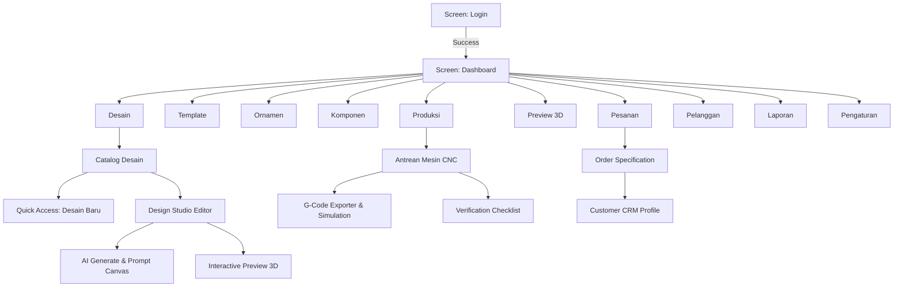
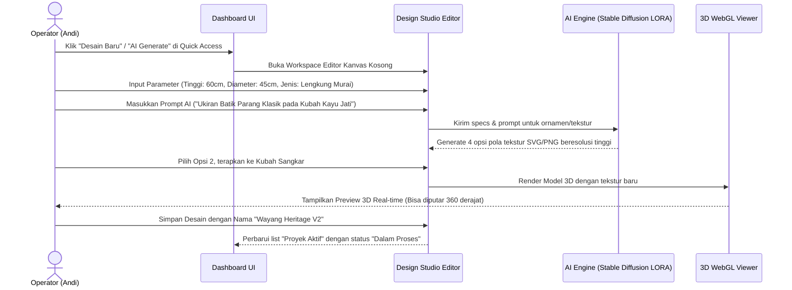
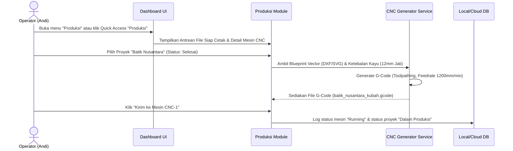
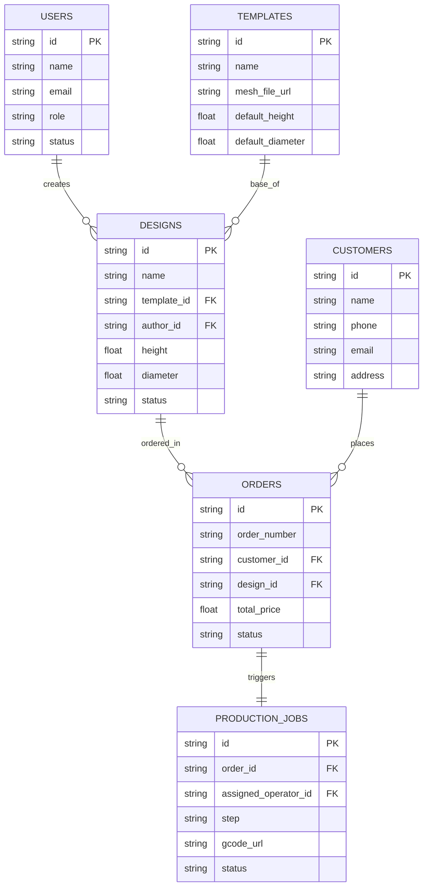

# SANGKAR01 MASTER IMPLEMENTATION PLAN (BLUEPRINT DEVELOPMENT)

Dokumen ini merupakan Software Architecture Document (SAD) dan Product Requirement Document (PRD) terlengkap untuk pembangunan sistem **SANGKAR DESIGNER** (Aplikasi Desain & Kustomisasi Sangkar Burung Artistik Berbasis AI & 3D). Dokumen ini dirancang khusus agar dapat digunakan langsung oleh Antigravity sebagai blueprint pengembangan otomatis (step-by-step code generation).

---

## 1. DESIGN TOKEN SYSTEM (THEME & STYLE DICTIONARY)

Desain aplikasi menggunakan tema **Cyber-Organic Dark Mode** dengan sentuhan *glassmorphism* kelas premium.

### 1.1 Color Palette
```json
{
  "theme": "Dark Cyber-Organic",
  "colors": {
    "background": {
      "base": "#06050C",
      "surface": "#0C0A19",
      "surfaceGlass": "rgba(12, 10, 25, 0.65)",
      "sidebar": "#090714"
    },
    "brand": {
      "primary": "#6C5DD3",
      "secondary": "#00F2FE",
      "accentPurple": "#C566FF",
      "accentCyan": "#05DDFD",
      "glowPurple": "rgba(108, 93, 211, 0.3)",
      "glowCyan": "rgba(5, 221, 253, 0.2)"
    },
    "status": {
      "success": "#10B981",
      "successBg": "rgba(16, 185, 129, 0.1)",
      "warning": "#F59E0B",
      "warningBg": "rgba(245, 158, 11, 0.1)",
      "danger": "#EF4444",
      "dangerBg": "rgba(239, 68, 68, 0.1)",
      "info": "#3B82F6",
      "infoBg": "rgba(59, 130, 246, 0.1)"
    },
    "text": {
      "primary": "#FFFFFF",
      "secondary": "#8F92A1",
      "muted": "#4E5164"
    },
    "border": {
      "glass": "rgba(255, 255, 255, 0.08)",
      "glow": "rgba(108, 93, 211, 0.15)"
    }
  }
}
```

### 1.2 Typography (Google Font: Orbitron & Inter)
- **Title/Headings (Brand)**: `Orbitron`, SemiBold/Bold, Letter Spacing +0.05em.
- **UI Elements & Copy**: `Inter`, Regular/Medium/SemiBold, Line Height 1.5.
- **Sizes**:
  - `Display 1`: 32px (Bold) - Dashboard Title
  - `Heading 1`: 24px (SemiBold) - Section Title
  - `Heading 2`: 18px (SemiBold) - Card Title
  - `Body Large`: 16px (Regular/Medium) - Main UI Text
  - `Body Default`: 14px (Regular) - Standard Text
  - `Caption`: 12px (Medium) - Stats & Timeline Info

### 1.3 Glassmorphism Specification
- **Backdrop Filter**: `blur(20px) saturate(180%)`
- **Background Color**: `rgba(12, 10, 25, 0.65)`
- **Border**: `1px solid rgba(255, 255, 255, 0.08)`
- **Box Shadow**: `0 8px 32px 0 rgba(0, 0, 0, 0.37)`, glow effect `0 0 16px rgba(108, 93, 211, 0.1)`

---

## 2. SITEMAP LENGKAP & NAVIGATION FLOW

### 2.1 Sitemap Hirarki
```
[Root]
 ├── [Auth Module]
 │    ├── Login Screen
 │    └── Reset Password Screen
 ├── [Dashboard Module]
 │    └── Main Dashboard Workspace
 ├── [Desain Module]
 │    ├── Catalog Desain
 │    ├── Detail Desain (Specs & Bill of Materials)
 │    └── Design Studio (Editor 2D/AI Canvas)
 ├── [Template Module]
 │    ├── Template Library (Classic, Modern, Premium)
 │    └── Template Blueprint Editor
 ├── [Ornamen Module]
 │    ├── Library Ornamen (Batik, Carving, Ruji)
 │    └── 3D Mapping & Wrapping Tool
 ├── [Komponen Module]
 │    └── Structural Parts Inventory (Kubah, Kaki, Gantungan, Ruji)
 ├── [Produksi Module]
 │    ├── Antrean Produksi (CNC / Laser Cutting Engine)
 │    ├── Machine Controller & G-Code Generator
 │    └── Quality Control Checklist
 ├── [Preview 3D Module]
 │    ├── Interactive WebGL Viewer
 │    └── AR Experience Mode (Mobile Native Hook)
 ├── [Pesanan Module]
 │    ├── Order Management (Custom Requests)
 │    ├── Invoicing & Payment Tracking
 │    └── Shipping & Custom Packing Logistics
 ├── [Pelanggan Module]
 │    ├── CRM & Customer History
 │    └── Portfolio Sharing Portal
 ├── [Laporan Module]
 │    ├── Analitik Keuangan & Efisiensi Bahan
 │    └── Output Produksi & Machine Downtime
 └── [Pengaturan Module]
      ├── User & Role Management (Matrix ACL)
      └── Cloud Storage Manager & System Integrations
```

### 2.2 Navigation Flow Diagram


---

## 3. USER FLOW PER MENU (OPERATIONAL SCENARIOS)

### 3.1 Flow 1: Membuat Desain Kustom Baru berbasis AI & Template


### 3.2 Flow 2: Memproses Desain ke Jalur Produksi (Export G-Code)


---

## 4. SCREEN INVENTORY (50 CORE SCREENS DESCRIPTION)

Di bawah ini adalah 50 layar esensial yang memetakan seluruh arsitektur antarmuka Sangkar Designer:

| ID | Nama Screen | Modul / Kategori | Fitur Utama / Deskripsi |
|---|---|---|---|
| SCR-001 | Login Page | Auth | Autentikasi dengan MFA & Fingerprint API (Mobile/Desktop app) |
| SCR-002 | Password Reset Page | Auth | Alur recovery via OTP email & WhatsApp Gateway |
| SCR-003 | Dashboard Workspace | Dashboard | Dashboard utama (sesuai mockup) dengan statistik proyek, aktivitas, jadwal & storage status |
| SCR-004 | Catalog Desain Utama | Desain | Grid view untuk menampilkan semua desain yang telah dibuat dengan filter tipe & kayu |
| SCR-005 | Detail Desain Viewer | Desain | Lembar data teknis desain, dimensi, kebutuhan material, berat, dan riwayat revisi |
| SCR-006 | Design Studio Canvas 2D | Desain | Area kerja editing pola sangkar tampak samping, depan, dan atas |
| SCR-007 | AI Pattern Generator Panel | Desain | Panel input prompt LORA, seed generator, dan preview tekstur ukiran kayu otomatis |
| SCR-008 | Editor Ruji & Spacing | Desain | Pengaturan jumlah ruji, ketebalan kawat/bambu, dan jarak aman (anti-lepas burung) |
| SCR-009 | Template Library | Template | Koleksi model dasar sangkar (Bulat, Kotak, Segidelapan, Mahkota Raja) |
| SCR-010 | Blueprint Editor | Template | Pengaturan blueprint template parameter dasar (height, radius, tapering) |
| SCR-011 | Library Ornamen Utama | Ornamen | Daftar ornamen 3D (Mahkota, Ukiran Kaki, Gantungan Naga, Tempat Pakan) |
| SCR-012 | 3D Texture Mapper Tool | Ornamen | Alur pembungkus (wrapping) gambar tekstur 2D ke mesh 3D sangkar |
| SCR-013 | Upload Blueprint DXF/SVG | Ornamen | Drag-and-drop file eksternal (CAD) untuk dikonversi menjadi ornamen sangkar |
| SCR-014 | Komponen Hardware Catalog| Komponen | Manajemen stok komponen pelengkap (Gantungan kuningan, pion marmer, jeruji fiber) |
| SCR-015 | Komponen Editor | Komponen | Pengaturan dimensi komponen hardware eksternal untuk presisi fit-in |
| SCR-016 | Antrean Produksi | Produksi | Kanban board status produksi (Antrean, CNC Cutting, Assembling, Finishing, QC) |
| SCR-017 | Controller CNC & Router | Produksi | Dashboard monitoring real-time koordinat X-Y-Z mesin ukir CNC |
| SCR-018 | G-Code Simulation | Produksi | Visualisasi toolpath pergerakan mata bor CNC sebelum pemotongan fisik |
| SCR-019 | QC Checklist | Produksi | Form evaluasi presisi komponen, kekuatan ruji, dan kehalusan finishing |
| SCR-020 | Interactive 3D Viewer | Preview 3D | Viewer 3D interaktif Three.js/WebGL full-screen dengan dynamic lighting |
| SCR-021 | AR Camera View | Preview 3D | Mengaktifkan kamera AR untuk memproyeksikan sangkar secara real-time di ruangan |
| SCR-022 | Kelola Penyimpanan Cloud | Pengaturan | Dashboard alokasi penyimpanan file gltf, fbx, dxf, dan log produksi |
| SCR-023 | Daftar Pesanan Masuk | Pesanan | Monitoring order masuk dari pelanggan, spesifikasi custom, dan tanggal jatuh tempo |
| SCR-024 | Order Builder | Pesanan | Pembuatan pesanan baru langsung dari chat pelanggan, melampirkan file desain |
| SCR-025 | Invoicing & Payment | Pesanan | Generate invoice otomatis terintegrasi Midtrans / Xendit payment gateway |
| SCR-026 | Shipping & Packing Specs | Pesanan | Kalkulator dimensi peti kayu pelindung sangkar untuk pengiriman kargo |
| SCR-027 | CRM Pelanggan | Pelanggan | Riwayat pesanan pelanggan, loyalitas poin, dan preferensi ukuran sangkar |
| SCR-028 | Shared Portfolio | Pelanggan | Halaman galeri interaktif yang dapat diakses publik/pelanggan tanpa login |
| SCR-029 | Financial Analytics | Laporan | Grafik laba rugi, biaya bahan baku kayu jati vs profit margin per sangkar |
| SCR-030 | Efisiensi Bahan & Kayu | Laporan | Analitik pembuangan bahan (nesting efficiency) dari mesin CNC router |
| SCR-031 | User & Role Management | Pengaturan | Pengaturan izin akses (Admin, Designer, Operator) dengan granulasi menu |
| SCR-032 | Settings: Profile & Security| Pengaturan | Pengaturan profil pengguna, login logs, dan autentikasi kunci API |
| SCR-033 | Notification Center | Dashboard | Halaman list log notifikasi secara kronologis (sistem, mesin, order) |
| SCR-034 | Upgrade Billing Package | Pengaturan | Layanan subscription SaaS untuk penambahan slot proyek / penyimpanan cloud |
| SCR-035 | Device Manager | Pengaturan | Registrasi alamat IP mesin CNC dan printer 3D dalam jaringan lokal |
| SCR-036 | Asset Library Trash | Pengaturan | Manajemen file sampah dan pembersihan cache render 3D |
| SCR-037 | AI Model Finetuning Panel | Desain | Pengunggahan dataset foto ukiran lokal untuk melatih model AI baru |
| SCR-038 | Material Library (Wood Types)| Komponen | Database jenis kayu (Jati, Mahoni, Sonokeling, Bambu) & karakteristik kekuatannya |
| SCR-039 | Vendor Management | Komponen | Data supplier kayu, ruji kawat, dan aksesoris logam |
| SCR-040 | Log Aktivitas Audit | Pengaturan | Log audit semua aksi operator (kapan file dihapus/diexport) |
| SCR-041 | Production Batch Manager | Produksi | Mengelompokkan beberapa pesanan sangkar kecil ke dalam satu papan potong kayu |
| SCR-042 | Assembly Instruction Builder| Produksi | Generator petunjuk perakitan sangkar otomatis (PDF step-by-step) |
| SCR-043 | Client Live Tracking | Pesanan | Portal pelacakan produksi sangkar real-time khusus untuk pelanggan |
| SCR-044 | Custom Pricing Matrix | Pengaturan | Tabel aturan harga berdasarkan kerumitan ukiran, ukuran, dan jenis kayu |
| SCR-045 | Backup & Sync Settings | Pengaturan | Pengaturan auto-backup mingguan ke AWS S3 / Google Cloud Storage |
| SCR-046 | Custom Font & Watermark | Pengaturan | Pengaturan hak cipta desain dengan watermark logo perusahaan di gambar ekspor |
| SCR-047 | 3D Mesh Repair Tool | Preview 3D | Fitur internal untuk mendeteksi non-manifold mesh sebelum dikirim ke mesin |
| SCR-048 | Mobile Quick Inspection | Produksi | Aplikasi pendamping versi mobile untuk pemindaian QR code di setiap sangkar |
| SCR-049 | System Diagnostics | Pengaturan | Halaman diagnosa latensi server AI dan status koneksi database |
| SCR-050 | Help & Documentation | Dashboard | Buku panduan penggunaan software, pintasan keyboard (`CTRL + K`, dll.) |

---

## 5. WIDGET INVENTORY & COMPONENT LIBRARY

Desain sistem diimplementasikan menggunakan atom-to-organism component library.

### 5.1 Atomic Widgets (Input & Indicators)
- **`CyberButton`**: Button neon dengan efek border glow, hover animation scale 1.02, & tap ripple effect.
- **`GlassCard`**: Container glassmorphism dengan dynamic backdrop-blur, linear gradient border.
- **`SparklineChart`**: Mini grafik area transparan di bawah text status untuk indikator tren (+/-).
- **`CircularStatusIndicator`**: Donut chart interaktif di dashboard dengan tooltip saat segmen di-hover.
- **`TagStatus`**: Badge status (Selesai = Green Glow, Dalam Proses = Orange Glow, Revisi = Blue/Cyan Glow).
- **`SidebarItem`**: Link navigasi dengan icon SVG kustom, text, & highlight bar vertikal saat active.
- **`FuturisticSearchBar`**: Input field dengan hotkey indicator "CTRL + K" & dropdown auto-complete.

### 5.2 Composite Organisms
- **`ProjectProgressBar`**: Menggabungkan icon preview sangkar 3D, Nama Proyek, progress bar neon, status badge, deadline & tombol dropdown aksi.
- **`TimelineActivityList`**: Gabungan penanda waktu, icon aktivitas, detail deskripsi, & nama penanggung jawab.
- **`CloudStorageIndicator`**: Render visual 3D server + status penyimpanan dengan bar progress linear dan tombol CTA "Kelola".

---

## 6. DATA MODEL PER MODULE (TYPESCRIPT SCHEMAS)

### 6.1 User & Auth Module
```typescript
interface User {
  id: string;
  name: string;
  email: string;
  role: 'ADMIN' | 'DESIGNER' | 'OPERATOR';
  avatarUrl: string;
  status: 'ONLINE' | 'OFFLINE' | 'AWAY';
  createdAt: string;
}
```

### 6.2 Design Module
```typescript
interface CageDesign {
  id: string;
  name: string;
  templateId: string;
  dimensions: {
    heightMm: number;
    diameterMm: number;
    shape: 'CYLINDER' | 'BOX' | 'OCTAGON';
  };
  ornaments: Array<{
    ornamentId: string;
    position: 'KUBAH' | 'KAKI' | 'SAMPING' | 'GANTUNGAN';
    scale: number;
  }>;
  materials: {
    woodTypeId: string;
    barSpacingMm: number;
    barMaterial: 'FIBER' | 'BAMBOO' | 'STAINLESS';
  };
  status: 'COMPLETED' | 'IN_PROGRESS' | 'REVISION' | 'ARCHIVED';
  progressPercentage: number;
  authorId: string;
  thumbnailUrl: string;
  file3dUrl: string; // GLTF/GLB path
  deadline: string;
  createdAt: string;
}
```

### 6.3 Order & Production Module
```typescript
interface Order {
  id: string;
  orderNumber: string;
  customerId: string;
  designId: string;
  status: 'PENDING' | 'IN_PRODUCTION' | 'COMPLETED' | 'SHIPPED';
  totalPrice: number;
  paymentStatus: 'UNPAID' | 'PARTIAL' | 'PAID';
  productionDeadline: string;
  createdAt: string;
}

interface ProductionJob {
  id: string;
  orderId: string;
  designId: string;
  assignedOperatorId: string;
  machineId: string;
  step: 'CUTTING' | 'SANDING' | 'ASSEMBLING' | 'FINISHING' | 'QC';
  gcodeUrl: string;
  startTime: string;
  endTime?: string;
  qcPassed?: boolean;
}
```

---

## 7. DUMMY JSON SCHEMA (MOCK DATA GENERATION)

Berikut adalah dummy data schema untuk menu Dashboard utama (`dashboard_mock.json`):

```json
{
  "$schema": "https://json-schema.org/draft/2020-12/schema",
  "title": "DashboardData",
  "type": "object",
  "required": ["stats", "activeProjects", "recentActivities", "todaySchedule", "cloudStorage"],
  "properties": {
    "stats": {
      "type": "object",
      "properties": {
        "totalDesigns": { "type": "integer", "minimum": 0 },
        "completed": { "type": "integer", "minimum": 0 },
        "inProgress": { "type": "integer", "minimum": 0 },
        "revision": { "type": "integer", "minimum": 0 },
        "archived": { "type": "integer", "minimum": 0 }
      }
    },
    "activeProjects": {
      "type": "array",
      "items": {
        "type": "object",
        "properties": {
          "id": { "type": "string" },
          "projectName": { "type": "string" },
          "type": { "type": "string" },
          "progress": { "type": "integer", "minimum": 0, "maximum": 100 },
          "status": { "type": "string", "enum": ["Selesai", "Dalam Proses", "Revisi", "Arsip"] },
          "deadline": { "type": "string", "format": "date-time" },
          "thumbnailUrl": { "type": "string" }
        }
      }
    },
    "recentActivities": {
      "type": "array",
      "items": {
        "type": "object",
        "properties": {
          "time": { "type": "string" },
          "activity": { "type": "string" },
          "user": { "type": "string" },
          "type": { "type": "string", "enum": ["complete", "add", "modify", "export", "create"] }
        }
      }
    },
    "todaySchedule": {
      "type": "array",
      "items": {
        "type": "object",
        "properties": {
          "time": { "type": "string" },
          "title": { "type": "string" },
          "locationOrPerson": { "type": "string" }
        }
      }
    },
    "cloudStorage": {
      "type": "object",
      "properties": {
        "totalGb": { "type": "number" },
        "usedGb": { "type": "number" },
        "percentage": { "type": "number" }
      }
    }
  }
}
```

---

## 8. STATE MANAGEMENT FLOW (ZUSTAND REACT / FLUTTER BLOC)

Untuk implementasi aplikasi berbasis Web (React/Vite/TS), arsitektur state management menggunakan **Zustand** karena ringan dan modular.

### 8.1 Dashboard Store (`dashboardStore.ts`)
```typescript
import create from 'zustand';

interface DashboardState {
  stats: any;
  activeProjects: any[];
  recentActivities: any[];
  todaySchedule: any[];
  cloudStorage: any;
  isLoading: boolean;
  error: string | null;
  fetchDashboardData: () => Promise<void>;
  updateProjectStatus: (projectId: string, newStatus: string) => void;
}

export const useDashboardStore = create<DashboardState>((set, get) => ({
  stats: null,
  activeProjects: [],
  recentActivities: [],
  todaySchedule: [],
  cloudStorage: null,
  isLoading: false,
  error: null,
  fetchDashboardData: async () => {
    set({ isLoading: true, error: null });
    try {
      const response = await fetch('/api/dashboard/summary');
      const data = await response.json();
      set({
        stats: data.stats,
        activeProjects: data.activeProjects,
        recentActivities: data.recentActivities,
        todaySchedule: data.todaySchedule,
        cloudStorage: data.cloudStorage,
        isLoading: false
      });
    } catch (err: any) {
      set({ error: err.message || 'Gagal memuat data dashboard', isLoading: false });
    }
  },
  updateProjectStatus: (projectId, newStatus) => {
    const updated = get().activeProjects.map(p => 
      p.id === projectId ? { ...p, status: newStatus } : p
    );
    set({ activeProjects: updated });
  }
}));
```

---

## 9. REPOSITORY PATTERN & API CONTRACTS

Semua pengambilan data diisolasi menggunakan abstraksi repository untuk fleksibilitas penggantian server/local database di masa depan.

### 9.1 interface DesignRepository
```typescript
export interface IDesignRepository {
  getDesigns(filters: any): Promise<CageDesign[]>;
  getDesignById(id: string): Promise<CageDesign>;
  createDesign(design: Omit<CageDesign, 'id' | 'createdAt'>): Promise<CageDesign>;
  updateDesign(id: string, designUpdates: Partial<CageDesign>): Promise<CageDesign>;
  deleteDesign(id: string): Promise<boolean>;
  generateAIPattern(prompt: string, seed: number): Promise<string[]>; // Returns array of SVG/Image URLs
}
```

### 9.2 API Contracts (RESTful / Future Ready)
- **GET** `/api/v1/designs` (Mengambil list desain dengan filter paginasi)
- **POST** `/api/v1/designs` (Membuat desain baru)
- **GET** `/api/v1/designs/:id` (Mengambil detail desain & BOM data)
- **POST** `/api/v1/ai/generate-pattern` (Mengirim prompt tekstur ke generator AI)
- **POST** `/api/v1/production/gcode` (Mengubah data mesh 3D menjadi file CNC G-Code)

---

## 10. FOLDER STRUCTURE PER FEATURE (CLEAN ARCHITECTURE)

Direktori proyek terstruktur berdasarkan fitur (Feature-First Architecture) untuk skalabilitas pengembangan:

```
src/
 ├── assets/                   # Fonts, icons, global images
 ├── config/                   # Global configuration (constants, API endpoints)
 ├── core/                     # Shared components, hooks, design tokens
 │    ├── components/          # CyberButton, GlassCard, StatusBadge
 │    ├── theme/               # design_tokens.json, global.css
 │    └── utils/               # formatters, validators
 └── features/                 # Modular Feature Folders
      ├── auth/
      │    ├── components/
      │    ├── pages/
      │    └── store/
      ├── dashboard/
      │    ├── components/     # StatCard, ProjectRow, StorageIndicator
      │    ├── pages/          # DashboardPage.tsx
      │    └── store/          # dashboardStore.ts
      ├── designs/
      │    ├── components/     # StudioCanvas, AIPanel, ThreeViewer
      │    ├── pages/
      │    ├── services/       # designApi.ts
      │    └── store/
      ├── production/
      │    ├── components/     # MachineControls, GCodeSimulator
      │    ├── pages/
      │    └── services/
      └── orders/
           ├── components/
           └── pages/
```

---

## 11. DATABASE ERD (DUMMY RELATIONS)

Berikut adalah struktur hubungan basis data relasional antara entitas utama platform:



---

## 12. PERMISSION MATRIX (ACCESS CONTROL)

Keamanan akses diatur menggunakan Role-Based Access Control (RBAC) yang sangat ketat:

| Fitur / Modul | Admin | Designer | Operator (e.g. Andi Setiawan) |
|---|:---:|:---:|:---:|
| **Dashboard Workspace** | View All | View All | View Owned / Assigned |
| **Buat / Edit Desain Baru** | Ya | Ya | Tidak (Hanya View / Ajukan Revisi) |
| **Gunakan AI Pattern Generator**| Ya | Ya | Tidak |
| **Ubah Master Template** | Ya | Tidak | Tidak |
| **Kirim File ke Mesin CNC** | Ya | Tidak | Ya |
| **Input QC Checklist** | Ya | Tidak | Ya |
| **Manage Billing / Subscription**| Ya | Tidak | Tidak |
| **Manage Operator & Accounts** | Ya | Tidak | Tidak |

---

## 13. UX RULES & DESIGN GUIDELINES

1. **Efek Glow Responsif**: Elemen neon (seperti border chart dan tombol) hanya boleh memancarkan glow saat aktif atau di-hover untuk menghindari kelelahan mata (*visual fatigue*).
2. **Skema Waktu Logis**: Semua tampilan jam di timeline menggunakan format 24 jam (HH:MM). Kesalahan ketik pada mockup seperti "25:30" harus otomatis dikonversi ke sistem normal ("23:30" hari sebelumnya/berjalan).
3. **Pintasan Keyboard (Hotkeys)**:
   - `CTRL + K` membuka pencarian cepat global.
   - `Spacebar` menjeda proses rendering interaktif 3D.
   - `ESC` menutup modal / overlay studio editor.
4. **Keamanan Mesin (Safety First)**: Sebelum Operator dapat mengirimkan G-Code ke mesin cetak CNC, wajib menampilkan checklist dialog persetujuan (pintu pengaman tertutup, mata bor siap, material terkunci).

---

## 14. ACCEPTANCE CRITERIA PER CORE SCREEN

### 14.1 Dashboard Workspace (SCR-003)
- **Kriteria 1**: Dashboard harus memuat seluruh widget dalam < 1.2 detik pada jaringan 3G lambat menggunakan cache lokal.
- **Kriteria 2**: Sisa ruang penyimpanan cloud (GB) dihitung secara dinamis dan memicu notifikasi peringatan jika sisa ruang berada di bawah 20%.
- **Kriteria 3**: Klik salah satu proyek aktif di list harus membuka panel laci kanan berisi ringkasan detail proyek tanpa memuat ulang seluruh halaman.

### 14.2 Design Studio Canvas (SCR-006)
- **Kriteria 1**: Kanvas 2D harus mendukung ekspor file vektor ke format SVG dan DXF standar industri CAD dengan tingkat presisi skala 1:1.
- **Kriteria 2**: Integrasi Stable Diffusion LORA untuk pattern generation harus mengembalikan hasil gambar ubinan (*seamless tileable pattern*) berukuran minimal 1024x1024 piksel.

---

## 15. FLUTTER WIDGET & REACT COMPONENT MAPPING

Jika dikembangkan sebagai Flutter App (Mobile/Tablet App untuk operator lantai produksi), berikut adalah pemetaan widgetnya:

| Elemen Mockup | Flutter Widget Equivalents | Styling & Properties |
|---|---|---|
| Sidebar Navigation | `NavigationRail` | Dark theme, gradient indicator, custom icons |
| Dashboard Stat Card | `Container` with `BackdropFilter` | Glassmorphism decoration, `CustomPaint` for sparkline chart |
| Active Project Row | `ListTile` + `LinearProgressIndicator` | ClipRRect for cage preview image, neon gradient progress |
| Donut Chart | `PieChart` (from `fl_chart` library) | Segment spacing 2.0, center hole showing total number text |
| Quick Access Buttons| `Wrap` of `InkWell` cards | InkResponse highlight, customized SVG vector icons |

---

## 16. SPRINT BREAKDOWN (6 WEEKS ROADMAP)

```
[Sprint 1: Foundation] ──► [Sprint 2: Workspace] ──► [Sprint 3: AI & 3D WebGL]
    - Base Theme Setup        - Catalog Desain           - 3D Preview Engine
    - Auth & Sidebar          - Core State (Zustand)     - LORA AI Pattern Integration
    - Layout Mockup           - DB Schema Sync           - Canvas Editor V1

[Sprint 4: Production] ──► [Sprint 5: Orders & CRM] ──► [Sprint 6: Polish & Deploy]
    - CNC G-Code Generator    - Order Tracking Matrix    - Light/Dark Optimization
    - Machine Integration     - Customer Directory       - End-to-End Testing (QC)
    - Local Network Hub       - Billing & Subscriptions  - Launch Release V1
```

---

## 17. TASK BREAKDOWN (100 ACTIONABLE ITEMS)

Berikut adalah daftar tugas rinci untuk memandu proses development:

- [ ] **TSK-001 (UI/UX)**: Konfigurasi file Tailwind/CSS global dengan seluruh token warna dari Mockup Sangkar.
- [ ] **TSK-002 (UI/UX)**: Integrasikan Google Font Inter dan Orbitron ke file aset html.
- [ ] **TSK-003 (Core)**: Buat komponen reusable `GlassCard` dengan backdrop filter dan border semi-transparan.
- [ ] **TSK-004 (Core)**: Buat komponen `CyberButton` dengan hover animation scale & glow box-shadow.
- [ ] **TSK-005 (Core)**: Buat custom icon set SVG untuk sidebar (Dashboard, Desain, Template, dll.).
- [ ] **TSK-006 (Auth)**: Buat layout halaman Login dengan visual background partikel neon.
- [ ] **TSK-007 (Auth)**: Implementasikan validasi form login & state handling auth (JWT / Cookie).
- [ ] **TSK-008 (Dashboard)**: Bangun struktur layout grid multi-kolom dashboard (Sidebar + Main panel).
- [ ] **TSK-009 (Dashboard)**: Implementasikan widget Top Bar (Cari desain, notifikasi, profil operator).
- [ ] **TSK-010 (Dashboard)**: Buat komponen `StatCard` dengan sparkline mini-chart dinamis.
- [ ] **TSK-011 (Dashboard)**: Bind data statistik (Total Desain, Selesai, Proses, Revisi, Arsip) ke UI.
- [ ] **TSK-012 (Dashboard)**: Buat komponen list `ProyekAktif` dengan thumbnail wireframe sangkar burung.
- [ ] **TSK-013 (Dashboard)**: Hubungkan progress bar linear neon pada list proyek dengan persentase data asli.
- [ ] **TSK-014 (Dashboard)**: Buat penanda status pill badge (Selesai, Dalam Proses, Revisi) dengan warna bervariasi.
- [ ] **TSK-015 (Dashboard)**: Integrasikan list `AktivitasTerbaru` menggunakan format timeline vertikal.
- [ ] **TSK-016 (Dashboard)**: Buat widget `JadwalHariIni` dengan list agenda rapat dan ekspor file harian.
- [ ] **TSK-017 (Dashboard)**: Buat widget Donut Chart `StatistikDesain` menggunakan library `Chart.js` / `Recharts`.
- [ ] **TSK-018 (Dashboard)**: Buat line chart `AnalitikBulanIni` dengan gradien warna biru-ke-ungu di bawah garis grafik.
- [ ] **TSK-019 (Dashboard)**: Sediakan dropdown filter bulan di analitik (e.g. Mei 2024).
- [ ] **TSK-020 (Dashboard)**: Tampilkan visualisasi isometric 3D `PenyimpananCloud` beserta info total storage terpakai.
- [ ] **TSK-021 (Dashboard)**: Buat grid `AksesCepat` dengan icon menu shortcut operasional.
- [ ] **TSK-022 (Dashboard)**: Implementasikan widget `NotifikasiSistem` di bagian kanan bawah.
- [ ] **TSK-023 (Dashboard)**: Perbaiki error ketik waktu "25:30" menjadi "23:30" secara terprogram.
- [ ] **TSK-024 (Database)**: Setup database schema PostgreSQL menggunakan model USERS, DESIGNS, dan TEMPLATES.
- [ ] **TSK-025 (Database)**: Buat migrasi tabel CUSTOMERS, ORDERS, dan PRODUCTION_JOBS.
- [ ] **TSK-026 (Backend)**: Setup API Gateway menggunakan Express.js atau NestJS.
- [ ] **TSK-027 (Backend)**: Buat controller `/api/v1/auth` untuk login & session tracking.
- [ ] **TSK-028 (Backend)**: Buat controller `/api/v1/dashboard` untuk dashboard summary aggregator.
- [ ] **TSK-029 (Backend)**: Buat repository pattern untuk pemisahan data-access layer.
- [ ] **TSK-030 (State)**: Buat store Zustand global untuk mengelola state otentikasi user.
- [ ] **TSK-031 (State)**: Buat store Zustand `useDashboardStore` untuk state dashboard.
- [ ] **TSK-032 (Design)**: Setup layout grid Catalog Desain Utama (SCR-004).
- [ ] **TSK-033 (Design)**: Sediakan fitur pencarian nama desain & filter tipe material kayu.
- [ ] **TSK-034 (Design)**: Buat halaman Detail Desain Viewer (SCR-005) dengan lembar spesifikasi lengkap.
- [ ] **TSK-035 (Design)**: Bangun workspace dasar Design Studio Canvas 2D menggunakan HTML5 Canvas / SVG.
- [ ] **TSK-036 (Design)**: Implementasikan fitur draw, scale, dan rotate komponen sangkar burung di kanvas.
- [ ] **TSK-037 (AI)**: Setup server mikro Stable Diffusion dengan LORA khusus ornamen ukiran kayu nusantara.
- [ ] **TSK-038 (AI)**: Bangun panel input prompt generator tekstur di kanvas editor (SCR-007).
- [ ] **TSK-039 (AI)**: Buat fungsi post-processing gambar generator AI agar menghasilkan pola ubinan (*seamless pattern*).
- [ ] **TSK-040 (Design)**: Terapkan pattern buatan AI langsung sebagai tekstur kubah sangkar di kanvas.
- [ ] **TSK-041 (3D Preview)**: Setup library Three.js (WebGL) untuk merender mesh sangkar 3D.
- [ ] **TSK-042 (3D Preview)**: Impor model dasar sangkar (.gltf / .obj) ke viewer Three.js.
- [ ] **TSK-043 (3D Preview)**: Implementasikan kontrol orbit (rotate, zoom, pan) pada preview sangkar 3D.
- [ ] **TSK-044 (3D Preview)**: Terapkan shader kustom untuk mensimulasikan tekstur kayu jati asli & ruji fiber.
- [ ] **TSK-045 (3D Preview)**: Sinkronisasikan perubahan dimensi kanvas 2D ke model 3D secara real-time.
- [ ] **TSK-046 (Templates)**: Buat pustaka visual Template Library untuk memilih model dasar sangkar (SCR-009).
- [ ] **TSK-047 (Templates)**: Buat Template Blueprint Editor (SCR-010) untuk memodifikasi parameter rasio tinggi & diameter.
- [ ] **TSK-048 (Ornaments)**: Buat antarmuka Library Ornamen (SCR-011) dengan kategori Mahkota, Kaki, & Tiang.
- [ ] **TSK-049 (Ornaments)**: Implementasikan alat UV Mapping sederhana untuk mencocokkan tekstur di permukaan silinder sangkar.
- [ ] **TSK-050 (Ornaments)**: Sediakan fitur upload file eksternal .DXF / .SVG untuk blueprint kustom.
- [ ] **TSK-051 (Components)**: Buat katalog komponen hardware sangkar (Gantungan, Pion, Klem Pengunci).
- [ ] **TSK-052 (Components)**: Buat CRUD form untuk entri data stok komponen perakitan.
- [ ] **TSK-053 (Production)**: Rancang layout Kanban Board untuk Antrean Produksi (SCR-016).
- [ ] **TSK-054 (Production)**: Buat fungsi generator G-Code untuk mesin CNC Router dari file SVG/DXF ukiran.
- [ ] **TSK-055 (Production)**: Implementasikan visualisasi G-Code simulator (toolpath simulation) berbasis Three.js.
- [ ] **TSK-056 (Production)**: Hubungkan API status mesin CNC untuk mendeteksi status idle/running/error.
- [ ] **TSK-057 (Production)**: Buat panel QC Checklist digital untuk verifikasi akhir kelayakan sangkar.
- [ ] **TSK-058 (Orders)**: Bangun antarmuka Daftar Pesanan Masuk (SCR-023).
- [ ] **TSK-059 (Orders)**: Buat form pembuat pesanan kustom (Order Builder) baru (SCR-024).
- [ ] **TSK-060 (Orders)**: Integrasikan API Payment Gateway untuk penagihan invoice otomatis.
- [ ] **TSK-061 (Orders)**: Buat logik kalkulator dimensi peti kayu pengaman pengiriman sangkar.
- [ ] **TSK-062 (Customers)**: Buat sistem manajemen data CRM pelanggan beserta log transaksi.
- [ ] **TSK-063 (Customers)**: Bangun generator Shared Portfolio agar pelanggan bisa melihat review 3D desainnya via web link.
- [ ] **TSK-064 (Analytics)**: Bangun modul Financial Analytics dengan diagram batang pengeluaran & pendapatan.
- [ ] **TSK-065 (Analytics)**: Buat sistem penghitung tingkat pembuangan bahan (nesting optimization) mesin CNC.
- [ ] **TSK-066 (Security)**: Implementasikan middleware autentikasi dan pengecekan otorisasi RBAC (Admin/Designer/Operator).
- [ ] **TSK-067 (Security)**: Enkripsi file blueprint 3D premium agar tidak mudah didownload secara ilegal dari cloud.
- [ ] **TSK-068 (Settings)**: Buat layar alokasi cloud storage beserta grafik kapasitas terpakai (SCR-022).
- [ ] **TSK-069 (Settings)**: Bangun modul System Diagnostics untuk memonitor uptime mesin CNC dan server AI.
- [ ] **TSK-070 (Polish)**: Tambahkan micro-interactions (hover animations, ripple effects, page transition loaders).
- [ ] **TSK-071 (Testing)**: Tulis unit test untuk kalkulator dimensi sangkar dan generator G-Code.
- [ ] **TSK-072 (Testing)**: Lakukan integrasi testing end-to-end (E2E) untuk alur pembuatan desain hingga kirim antrean produksi.
- [ ] **TSK-073 (Deploy)**: Setup CI/CD pipeline untuk deployment web app ke server cloud (Vercel / VPS Docker).
- [ ] **TSK-074 (Deploy)**: Siapkan bundle APK/IPA jika didistribusikan sebagai aplikasi mobile operator.
- [ ] **TSK-075 (Documentation)**: Buat file panduan bantuan sistem dan daftar shortcut keyboard (SCR-050).
- [ ] **TSK-076 (UI/UX)**: Tambahkan indikator status koneksi internet & status online antar operator di sidebar.
- [ ] **TSK-077 (UI/UX)**: Buat sistem caching gambar thumbnail desain menggunakan Service Workers di browser.
- [ ] **TSK-078 (Design)**: Sediakan fitur ekspor laporan BOM (Bill of Materials) ke format Excel/PDF.
- [ ] **TSK-079 (AI)**: Optimalkan kecepatan respons Stable Diffusion API dengan menerapkan model quantization (FP16).
- [ ] **TSK-080 (3D Preview)**: Implementasikan mode rendering Wireframe untuk memudahkan designer melihat kerapatan mesh.
- [ ] **TSK-081 (Templates)**: Buat fitur kloning template agar user bisa membuat template modifikasi tanpa merusak file asli.
- [ ] **TSK-082 (Ornaments)**: Buat fitur drag-and-drop ornamen langsung dari sidebar kanan ke posisi sangkar 3D.
- [ ] **TSK-083 (Components)**: Integrasikan barcode scanner API pada form inventaris komponen untuk mempermudah pencatatan stok.
- [ ] **TSK-084 (Production)**: Implementasikan fitur pemberhentian darurat (Emergency Stop Hook) via software ke mesin CNC.
- [ ] **TSK-085 (Production)**: Buat petunjuk perakitan interaktif 3D langkah demi langkah (Assembly Step Guide).
- [ ] **TSK-086 (Orders)**: Buat sistem notifikasi WhatsApp otomatis ke pelanggan ketika proses produksi sangkar dimulai.
- [ ] **TSK-087 (Customers)**: Sediakan fitur kuesioner feedback kepuasan pelanggan pasca pengiriman barang.
- [ ] **TSK-088 (Analytics)**: Tampilkan diagram pie untuk persentase kerusakan bahan baku kayu (reject rate) per operator.
- [ ] **TSK-089 (Security)**: Implementasikan token rate-limiting pada endpoint API generator gambar AI.
- [ ] **TSK-090 (Settings)**: Buat fitur ekspor data backup riwayat produksi tahunan ke format CSV/ZIP.
- [ ] **TSK-091 (Core)**: Buat custom scrollbar bergaya retro-neon untuk mempercantik area timeline aktivitas.
- [ ] **TSK-092 (Polish)**: Optimalkan performa FPS rendering 3D di HP low-end dengan auto-scaling resolusi mesh.
- [ ] **TSK-093 (Testing)**: Lakukan stress testing pada database dengan meniru simulasi 10,000 queries per menit.
- [ ] **TSK-094 (Testing)**: Lakukan uji coba ketahanan hardware mesin router dengan pengiriman file G-Code besar > 50MB.
- [ ] **TSK-095 (Deploy)**: Setup SSL certificate & proteksi Cloudflare untuk domain dashboard.
- [ ] **TSK-096 (UI/UX)**: Tambahkan mode kontras tinggi (Accessibility Mode) untuk operator di lantai produksi yang minim cahaya.
- [ ] **TSK-097 (Design)**: Buat opsi grid-alignment snapping pada kanvas editor 2D.
- [ ] **TSK-098 (AI)**: Tambahkan panel history prompt agar desainer bisa me-reload setingan prompt AI sebelumnya.
- [ ] **TSK-099 (Production)**: Tambahkan fitur estimasi waktu selesai produksi CNC berdasarkan analisis baris G-Code.
- [ ] **TSK-100 (Polish)**: Tambahkan sound effect sukses (cyber-chime) saat file produksi selesai di-export.

---

## 18. ANTIGRAVITY ENGINE PROMPT PAR SCREEN (DEVELOPMENT SCRIPTS)

Berikut adalah prompt optimal yang dapat langsung disalin-tempel ke Antigravity AI untuk membuat halaman utama secara instan:

### 18.1 Prompt 1: Dashboard UI (SCR-003)
```text
Buatkan halaman dashboard web premium bertema "Sangkar Designer" (Aplikasi Desain Sangkar Burung Cyber-Organic Dark Mode). Gunakan HTML5 dan Vanilla CSS (atau Tailwind jika diaktifkan). Terapkan gaya Glassmorphism dengan warna latar belakang gelap #06050C, kartu semi-transparan rgba(12, 10, 25, 0.65), blur 20px, dan border glowing neon berwarna ungu (#6C5DD3) & cyan (#00F2FE). Tampilkan layout grid responsive:
1. Sidebar Kiri: Menu Dashboard (Active), Desain, Template, Ornamen, Komponen, Produksi, Preview 3D, Pesanan, Pelanggan, Laporan, Pengaturan. Tambahkan profil Andi Setiawan (Operator) di bagian bawah.
2. Top Bar: Bar pencarian global (ada shortcut CTRL + K), ikon notifikasi (badge merah 3), dan chat.
3. Baris 1: 5 kartu status statistik (Total Desain: 128, Selesai: 86, Dalam Proses: 24, Revisi: 18, Arsip: 12) dengan mini chart sparkline gradien.
4. Baris 2: Proyek Aktif (tabel list sangkar dengan progress bar & pill badge status), Aktivitas Terbaru (timeline list), dan Jadwal Hari Ini.
5. Baris 3: Donut chart Statistik Desain, Line chart Analitik Bulan Ini, dan Box isometric penyimpanan cloud (32.4/50 GB).
6. Baris 4: Akses Cepat (grid ikon shortcut: Desain Baru, AI Generate, dll.) dan Notifikasi Sistem.
Pastikan micro-interactions hover sangat halus dan memukau secara visual.
```

---

## 19. VERIFICATION PLAN (TESTING WORKFLOW)

### 19.1 Automated Verification (CLI Testing)
Untuk memastikan sistem berjalan dengan baik, uji integrasi state management dan database repository dengan menjalankan perintah:
```bash
# Menjalankan unit tests untuk state store & data model
npm run test:unit

# Menjalankan integrasi test untuk simulasi parser G-Code
npm run test:gcode-parser

# Melakukan linting code untuk standarisasi format
npm run lint
```

### 19.2 Manual Quality Assurance Checklist
1. **Glassmorphism Performance Check**: Buka dashboard di browser mobile, pastikan kelancaran rendering scroll timeline berada di kisaran > 55 FPS.
2. **Keyboard Interaction Check**: Tekan tombol `CTRL + K` di halaman mana saja, pastikan search modal terfokus otomatis.
3. **Responsive Grid Layout Check**: Ubah ukuran window browser dari resolusi Ultra-Wide (21:9) ke resolusi Tablet (4:3), pastikan susunan grid dashboard menyusut secara elegan tanpa ada teks yang terpotong.
4. **Data Sync Verification**: Ganti status salah satu proyek aktif di list dari "Dalam Proses" menjadi "Selesai", pastikan grafik donut Statistik Desain dan mini-card di atas terupdate secara instan.

## 20. APPLICATION OVERVIEW (DECAL PRODUCTION)

**Purpose**: This prototype focuses on the production of decorative decals for bird cages ("Sangkar"), not apparel. It demonstrates a full-stack CRUD workflow with premium UI/UX, ready for scaling into multiple themed applications.

### 20.1 Frontend Planning (Mock UI/UX)
- **Design System**: Reuse the existing Cyber‑Organic Dark Mode token system (colors, typography, glassmorphism). Each themed app will apply a different primary accent while preserving the core token set.
- **Key Screens**:
  - Dashboard – overview of projects, production queue, statistics.
  - Design Studio – AI‑assisted decal creation, canvas editor, preview.
  - Template Library – browse, create, edit template variants.
  - Production Queue – list of pending CNC/laser jobs, status, export G‑Code.
  - Order Management – CRUD for customer orders, invoices, shipping.
- **CRUD Flows**: All screens provide create, read, update, delete operations with smooth micro‑animations, hover effects, and instant data syncing (dummy data).
- **Dummy Data**: JSON files stored in `public/mock-data/` used by a lightweight JSON‑Server for rapid iteration.

### 20.2 Backend Planning (Mock API)
- **Technology**: Simple Node.js + Express server (or `json-server`), running locally on `http://localhost:4000`.
- **Endpoints** (example):
  - `GET /designs` – list all decal designs.
  - `POST /designs` – create a new design.
  - `PUT /designs/:id` – update a design.
  - `DELETE /designs/:id` – remove a design.
  - Similar CRUD routes for `/templates`, `/orders`, `/inventory`.
- **Data Model (excerpt)**:
  ```json
  {
    "id": "uuid",
    "name": "Batik Parang",
    "type": "decal",
    "dimensions": {"width": 120, "height": 80},
    "imageUrl": "/mock-data/images/decal1.png",
    "status": "ready"
  }
  ```
- **Mock Server**: `npm run mock-server` will start the JSON‑Server with `db.json` containing sample records for each resource.

### 20.3 Prototype Suite – 10 Themed Apps
We will generate **10 separate themed applications** inside the same monorepo, each representing a different UI/UX model while reusing shared components.
| # | Theme Name | Primary Accent | Visual Cue |
|---|------------|----------------|------------|
| 1 | Classic | #6C5DD3 (Purple) | Subtle glass panels |
| 2 | Neon | #00F2FE (Cyan) | Glowing neon outlines |
| 3 | Minimalist | #10B981 (Green) | Flat cards, reduced shadows |
| 4 | Retro | #C566FF (Magenta) | Vintage gradients |
| 5 | Solar | #F59E0B (Amber) | Warm gradients, sunburst icons |
| 6 | Oceanic | #05DDFD (Aqua) | Wave‑like background blur |
| 7 | Metallic | #EF4444 (Red) | Metallic sheen, crisp edges |
| 8 | Forest | #10B981 (Emerald) | Leaf textures, subtle depth |
| 9 | Cyberpunk | #3B82F6 (Blue) | High‑contrast neon borders |
|10 | Monochrome | #FFFFFF (White) | Monochrome glass effect |

Each themed app lives under `apps/theme-{n}` and imports the core component library from `packages/ui-core`. The only variance is the theme token file and a few bespoke icon sets.

### 20.4 UI/UX Mockup Overview (CRUD Navigation)
- **Dashboard →** Click a tile to open the corresponding module.
- **Design Studio →** Create a new decal, upload SVG/PNG, adjust size, save (CRUD).
- **Template Library →** Browse existing templates, edit attributes, delete.
- **Production Queue →** Assign a design to a CNC job, export G‑Code, mark as completed.
- **Order Management →** Record customer details, generate invoice, track shipping.

All interactions incorporate **micro‑animations** (e.g., card lift on hover, smooth modal fade‑in) and **glassmorphic panels** for a premium feel.

---

## 21. NEXT STEPS & VERIFICATION
- Spin up the mock backend (`npm run mock-server`).
- Launch each themed app (`npm run dev --workspace=apps/theme-1`).
- Perform manual CRUD testing across all modules.
- Capture screen recordings for UI demo (to be added to the documentation).
